<!-- Portrait and wordmark retain the original SVG terminal animations. -->

<h3><code>abbas@github:~$ whoami</code></h3>

<table>
<tr>
<td valign="top"></td>
<td valign="top"></td>
</tr>
</table>

  

<h3><code>abbas@github:~$ ./contributions.sh</code></h3>

  

<h3><code>abbas@github:~$ cat about-me.txt</code></h3>

<b>About Me</b>

<b>Backend Engineer · Java · Spring Boot · Kafka · Distributed Systems · GenAI</b> 
Currently preparing for Amazon SDE

<h3><code>abbas@github:~$ ./skills.sh</code></h3>

 

<!-- Keep the profile snake at the end of the README. -->

