<h1 align="center">
    
</h1>

<h3 align="center">A backend-focused software developer from India </h3>

 

 
 🔭 I’m currently working on **Java + Spring Boot microservices**  
 
 🌱 I’m currently learning **Spring Security, JWT, and scalable backend design**  

 💬 Ask me about **Java, Spring Boot, Microservices, React (TypeScript), Node.js, MongoDB**  
 
 

 

 
  
  
  

 

 
<h2 align="center">⚒️ Languages-Frameworks-Tools ⚒️</h2>
 

     
    

 

  <h2>🐍 My Contributions 🐍</h2>
   
  
  
     

<h3><code>avi@github ~ $ whoami</code></h3>

<table>
<tr>
<td valign="top"></td>
<td valign="top"></td>
</tr>
</table>

 
 

  

<h3 align="center">
    
</h3>

 
